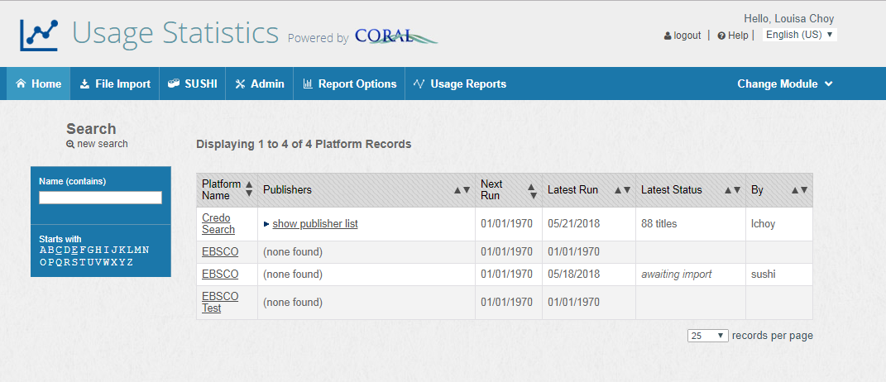
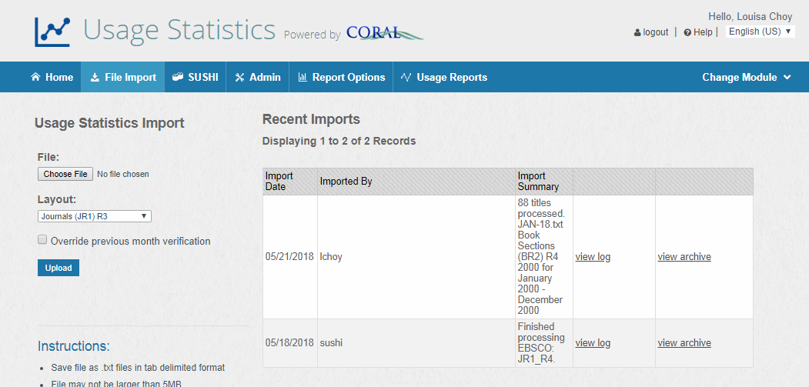
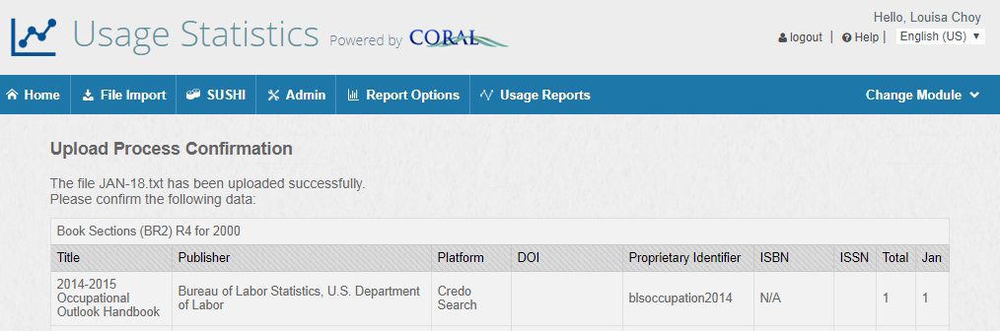
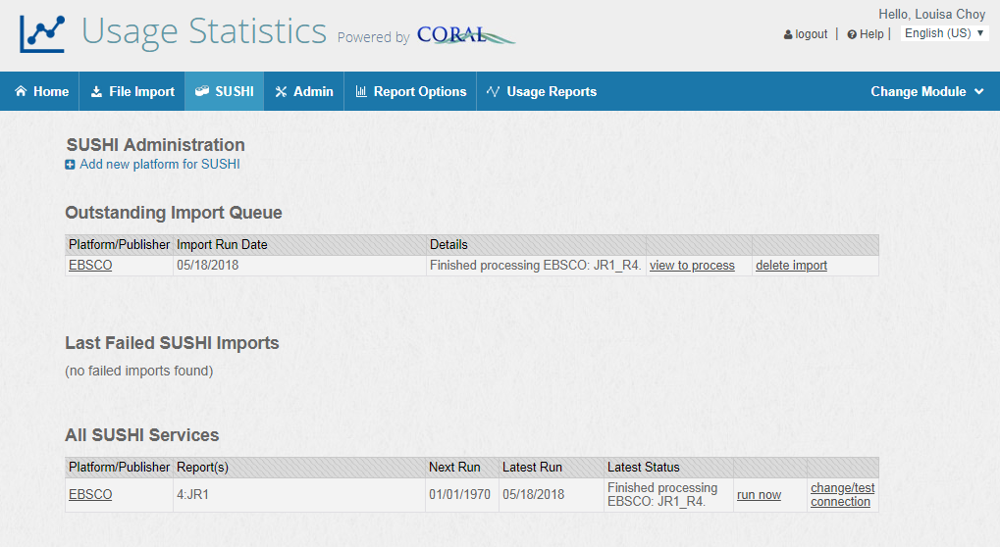
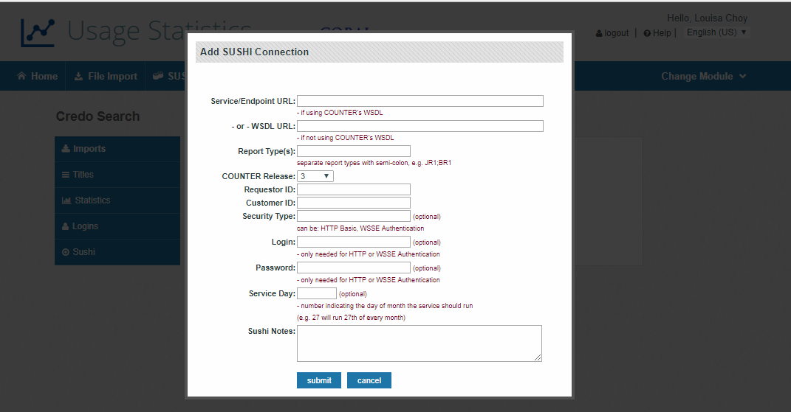
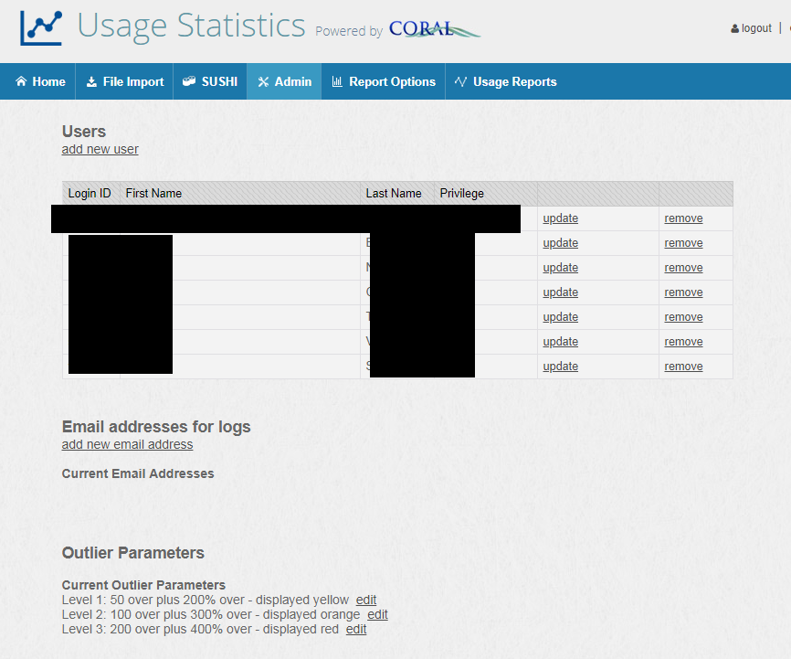

CORAL Usage Statistics User Guide
---------------------------------

### About CORAL Usage Statistics

A component of Hesburgh Libraries locally developed ERM, CORAL Usage Statistics provides a solution for storing and managing electronic journal full text download statistic reports. CORAL Usage Statistics currently supports a variety of JR and BR reports. CORAL Usage Statistics also includes a reporting solution allowing library personnel to retrieve statistics reports. This reporting solution is available as an add-on and must be installed separately. Please see the Usage Reporting Add-On Technical Documentation for more information

.

### Component Overview

CORAL Usage Statistics has six major components in the primary
navigation at the top of each page.

-   Home
-   File Import
-   SUSHI
-   Admin
-   Report Options
-   Usage Report

#### Home

The Home screen displays a table of platforms, their associated publishers, dates for when a report was last run for the platform and when the next run would be, and status information about the report. Platform records are created from the File Import process.  

#### File Import

New statistics reports are uploaded through the File Import page. CORAL Usage Statistics currently supports a range of reports (JR1, BR1, BR2, and DB4) in Revisions 3 and 4 or any report that has been formatted according to those standards. All reports must first be saved as tab delimited text files before being loaded into CORAL. The heading for the month columns should be formatted as MMM-YY.  For example, JAN-18 for January 2018.  

On the left column of the page are the options for loading the statistics reports. When processing a new file, CORAL will try and determine whether the statistics being loaded already exist in the system. For example, if January and February 2009 statistics for a specific publisher already exist in the system CORAL will not import those months again on subsequent loads. The ‘Override previous month verification’ checkbox is available if the user wishes to bypass this check and to re-import all of the data.

When a new file is loaded the data is first displayed on screen before it is committed to the database. This allows the user a chance to scan the data for errors before deciding to either confirm the upload or to cancel.

One the right column is a list of all imported files sorted by most recent. The list includes the date stamp for the upload, the user who uploaded the file, the file name, the user who uploaded the file and detail showing the number of titles processed. All uploaded files are saved in their original format on the server and made available in case they are needed in the future. CORAL produces a detailed log file of the upload which includes any errors that may occur. 

When a new file is loaded an entry, a Platform and Publisher combination listed in the file is created. From the homepage, you can view the publisher list or click on the platform name.  The platform name will bring you to the Publisher/Platform record. Information on this page includes the statistics data as well as the administrator login required to download new reports from the publishers’ website. 

####SUSHI

The SUSHI page contains a link to add a new platform for running SUSHI reports, thereby creating a Publisher/Platform record.  This page also contains information about outstanding imports, last failed SUSHI Imports, and all SUSHI services that have been set up.  There are also options to visit the Publisher/Platform record for which SUSHI has already been set up,  run the SUSHI report on demand and change/test the SUSHI connection.      

####Publisher/Platform Record

A Publisher/Platform Record can be created two ways:  automatically through the File Import Process or manually by adding a new platform within the SUSHI tab on the main navigation.  Seen here is the platform record for Credo.  The information is separated among five tabs; Imports, Titles, Statistics, Logins, and Sushi.  The Imports tab contains the import history for the platform.
  

The Titles tab contains a link to a spreadsheet of the titles that were included in the uploaded reports for the Platform.  A quick scan of this page after loading a new report will allow the user to check for any data problems such as duplicate titles or missing ISSN information. 

The Statistics tab shows all the statistics which have been loaded for the specific Platform or Publisher sorted with most recent year first. The data for each year can quickly be opened for viewing in Excel using the ‘view spreadsheet’ link. It is also possible to delete the data for individual months.

CORAL Usage Statistics also offers the ability to view and edit outlier use. When new statistics are loaded into the system, CORAL processes the data title by title and month by month. For each title, the system compares each new month’s data against the previous twelve months’ average. The system will tag the month as an ‘outlier’ if the new month’s data is significantly higher than the expected range of use. Consider for example a journal which averages ten downloads per month but then in a new report one of the months shows two thousand downloads. Two thousand is significantly higher than expected and CORAL will flag this month as an outlier. This is an extreme example but in the case of individuals creating personal article archives is not entirely uncommon.

Through the ‘view outliers for this month’ link the user has the ability to either ignore the outlier, marking it as acceptable, or to override the outlier with a number that makes more sense and excludes the problematic use spike. CORAL Usage Statistics allows for three levels of outliers. The three levels or formulas for the outlier check are edited on the Admin page discussed next and are also color coded yellow, orange and red with red being the worst and most extreme outliers.

The Logins tab contains the administrator username/password login required to download new statistics reports. This information can be added in two ways. First, the login can be added to the record using the ‘add new login’ link. This opens a new pop-up edit window where the username, password, url and any pertinent notes are entered. Alternatively, if the login already exists in the Organizations module a link to the Organization record can be added. This will then display any matching logins from the Organizations module here in CORAL Usage.

The SUSHI tab contains SUSHI Connection information.  The SUSHI protocol allows you to automate the collection of usage stats from compliant vendors.  

#### Admin

There are three sections on the CORAL Usage Statistics Admin page; Users, Email Addresses and Outlier Parameters. When adding new users to the system there are only two privilege levels available; admin and add/edit. There is no view only option available. The Usage Reporting Add-On offers a reporting page which will be the primary way library personnel acquire and download statistics reports. The statistics module is then meant as the back-end system through which the statistics are managed and as such needs to be accessed only by staff responsible for loading and managing the reports.

The ‘Email addresses for logs’ section identifies which addresses will receive an email with a link to the log file created for each new uploaded report.

The Outlier Parameters section is where the user will edit the outlier formula used to identify use spikes. There are three levels. The Level 1 example in the above picture will flag an outlier if a specific month’s use is at least fifty more than two hundred percent above the previous twelve month average. The formula includes more than a simple percentage over the previous twelve month average in order to avoid low use titles being flagged with outliers. The following is an example scenario.

A journal consistently receives two article downloads per month but then the next month has thirty downloads. There is a significant percentage increase from two to thirty and as such this would be flagged as an outlier but with only thirty downloads the total use is still not very significant. The addition of the ’50 over’ the percent increase will cause the system to ignore any use lower than fifty downloads regardless of the percentage increase from the previous twelve month average.

#### Report Options

If the Usage Reporting Add-on is installed, the Report Options page will
appear. This page allows editing of the values that display in the
Provider / Publisher report parameters in the Usage Reporting Add-On.
The Publisher and Platform names used by CORAL Usage Statistics come
directly from the Publisher and Platform columns in the uploaded
statistics reports. Unfortunately the names included in those reports
are not always the names most familiar to users. The Report Options page
allows for a local display name to be added for each Platform and
Publisher using the ‘edit report display name’ link. ‘CJO’ for example
is the Platform name used on the Cambridge Journals COUNTER report. It
makes sense in that case to add a display name for ‘Cambridge Journals
Online’ or something similar so that the value could be recognized in
the Provider / Publisher dropdown in the Usage Reporting Add-On.

CORAL Usage Statistics also offers the ability to control which
Platforms and Publishers display in the dropdown menu in Usage
Reporting. MetaPress for example is a Platform which contains many
publishers, some of which library personnel may not use or need to
query. The Report Options page offers the ability to select the
‘Available as Default Report’ checkbox for each Platform and Publisher
which should appear within the dropdown menus in the Usage Reporting
Add-On. Adding every Platform and Publisher to the dropdown menu may
result in a dropdown which is too long to be used. The checkbox allows
for only the relevant Platform and Publisher names to be included.

#### Usage Reports

The Usage Reports Add-On offers a clean and easy to navigate reporting
page which library personnel can use to access and download the
statistics reports. Please see the Usage Reporting Add-On Technical
Documentation for installation instructions.

There are six different reports available.

-    Usage Statistics - Provider Rollup: Total full text downloads per year for each
    Provider

-    Usage Statistics - Publisher Rollup: Total full text downloads per year for each
    Publisher

-    Usage Statistics - Top Resource Requests: Most used titles

-   Usage Statistics - Yearly Usage Statistics: Summary YTD totals listed by title for all
    years

-   Usage Statistics by Provider / Publisher: The standard JR1 article
    downloads reports

-   Usage Statistics by Title: Search by individual journal title or ISSN

The selected report is displayed on-screen as in the following picture
with the option to then export to Excel.

The query parameters are displayed in the top right of the page along
with a link to modify the parameters and icons for both printing and
exporting the report. 